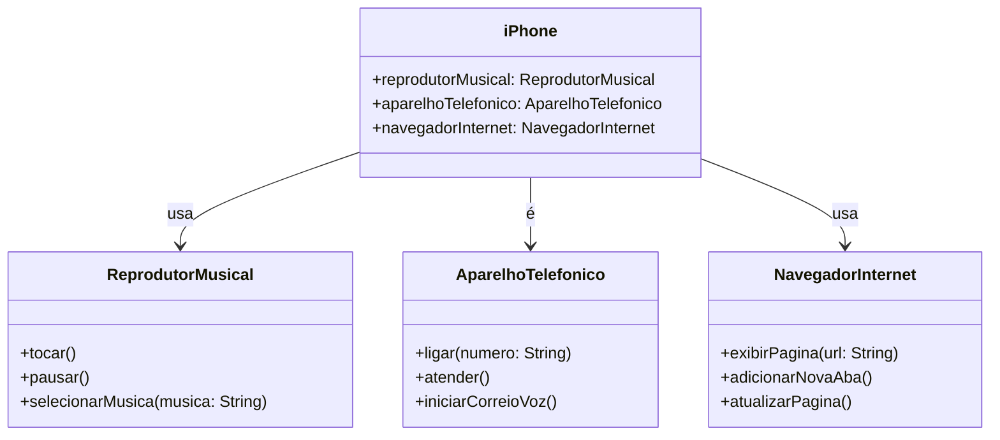

# Diagrama UML de classes

```mermaid
classDiagram
    class ReprodutorMusical {
        +tocar()
        +pausar()
        +selecionarMusica(musica: String)
    }

    class AparelhoTelefonico {
        +ligar(numero: String)
        +atender()
        +iniciarCorreioVoz()
    }

    class NavegadorInternet {
        +exibirPagina(url: String)
        +adicionarNovaAba()
        +atualizarPagina()
    }

    class iPhone {
        +reprodutorMusical: ReprodutorMusical
        +aparelhoTelefonico: AparelhoTelefonico
        +navegadorInternet: NavegadorInternet
    }

    iPhone --> ReprodutorMusical : usa
    iPhone --> AparelhoTelefonico : é
    iPhone --> NavegadorInternet : usa
```